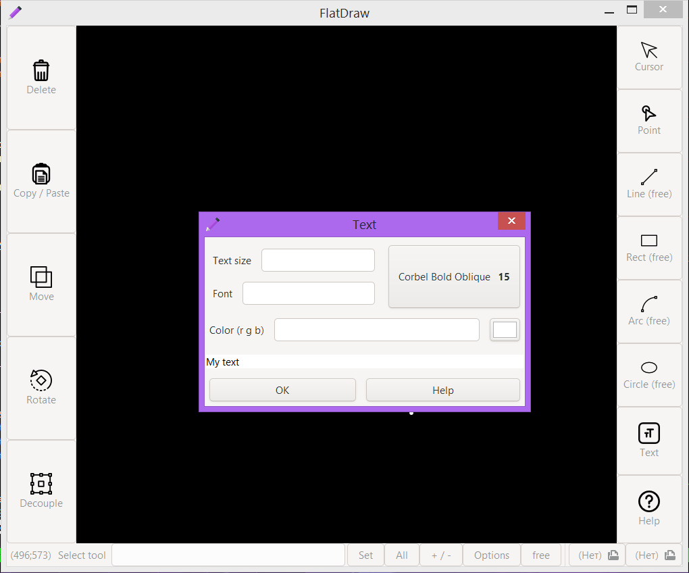

# FlatDraw -- minimalistic CAD

## Features
the program is still under development, but the following features are already available:
+ Drawing points
+ Drawing lines at 2 points
+ Drawing lines by point, length, and angle
+ Drawing a rectangle by 2 points
+ Drawing a rectangles by width and height
+ Drawing circles by center and radius (free mode)
+ Drawing circles by radius (parametric mode)
+ Drawing arcs by 2 angles and radius (parametric mode)
+ Layers
+ Save / Open
+ Selecting
+ Deleting
+ Free / parametric mode
+ Moving
+ Copy / paste
+ Decouple of rectangles
+ Figure rotation
+ Text

in development:
+ arcs
+ other functions

supported formats
+ fd -- internal format of the FlatDraw

the program also supports bindings:
+ To points
+ Intersection bindings
+ Vertical Bindings

## building
### please do not clone the repository if you are going to use the program, download the release
To compile and run the program successfully, you will need:
+ gcc compiler
+ gtk library (+ glib, pango, dbus, etc.)
+ cairo library
+ pkg-config
+ make

To compile, type:
```
make rel
```

## documentation
at the moment the documentation for fd sources is written
see [here](doc/fd_doc.md)

## user manual
there is also a user manual it is [here](doc/user_manual.md)

## screenshots




## icons
the icons were borrowed from [this](https://www.flaticon.com/packs/vector-editing-tools-15?k=1605709294421) and [this](https://www.flaticon.com/packs/text-edition) sites
