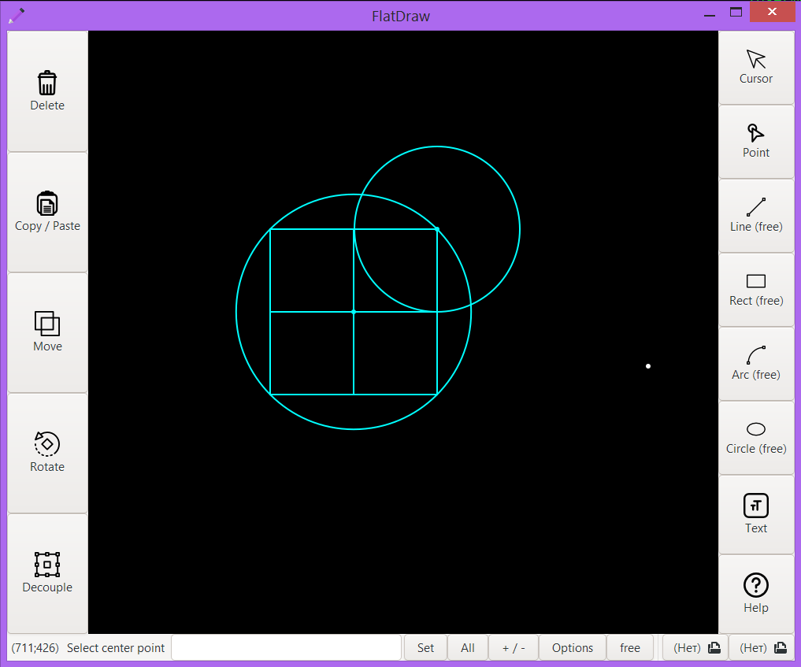

# FlatDraw -- the program is a cross between Paint and professional CAD

## Features
the program is still under development, but the following features are already available:
+ Drawing points
+ Drawing lines at 2 points
+ Drawing lines by point, length, and angle
+ Drawing a rectangle by 2 points
+ Drawing a rectabgles by width and height
+ Drawing circles
+ Layers
+ Save / Open
+ Selecting
+ Deleting

in development:
+ arcs
+ additional funcs (rotate, move, copy / past, decouple)

supported formats
+ fd -- internal format of the FlatDraw

the program also supports bindings:
+ To points
+ Intersection bindings
+ Vertical Bindings

## building
To compile and run the program successfully, you will need:
+ gcc compiler
+ gtk library
+ cairo library
+ pkg-config
+ make

To compile, type:
```
make rel
```

## screenshots



