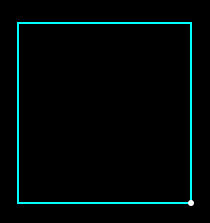
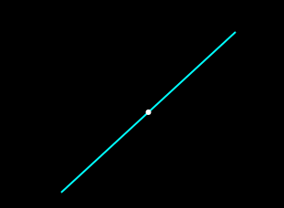
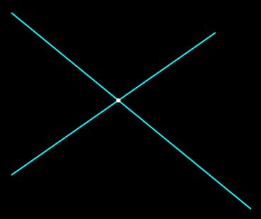
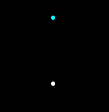

# description of all functions and header files included in FlatDraw

## header list
Name                   | Short description
---------------------- | -------------------------------------------------
[binding.h](#bh)       | implements bindings
[callbacks.h](#ch)     | contains callback functions
[click_handle.h](#chh) | contains functions for handling clicks
[color.h](#clh)        | contains color schemes
[dbg.h](#dbh)          | special header that defines the DBG symbol
[draw.h](#dh)          | contains functions for drawing
[fd_format.h](#ffh)    | contains functions for outputting shapes to a file
[figure.h](#fh)        | includes functions for creating and processing shapes
[geometry.h](#gh)      | includes functions for creating and processing geometry
[list.h](#lh)          | implements a doubly linked list of shapes

## headers description
<a name="bh"></a>
# binding.h
this file includes functions for creating three types of bindings: object bindings, binding of intersection, and vertical bindings
#### object bindings
object snaps, the cursor is fixed on the object




*here white point is the cursor snapped to the edge of the rect*

#### intersection bindings
these bindings are formed at the intersection of 2 objects:



#### vertical bindings
these bindings are to the x or y of another object:



#### functions
+ `void bl_bind(list *lptr, double *x, double *y);` -- this function creates a binding for the x and y coordinates relative to the list of lptr shapes
+ `char *bl_try_make_object_bind(list *lptr, double *x, double *y);` -- an internal function that attempts to create an object binding to an object
+ `char *bl_try_make_intersection_binding(list *lptr, double *x, double *y);` -- tries to create an intersection binding, otherwise similar `bl_try_make_object_binding`
+ `char *bl_try_make_vertical_binding(list *lptr, double *x, double *y);` -- tries to create a vertical binding, similar to `bl_try_make_object_binding`
+ `int bl_is_create_binding(figure *target, double x, double y);` -- returns 1 if you can create an object binding, 0 otherwise
+ `double bl_get_coords_dif(double c1, double c2);` -- returns the difference of the coordinates
+ `int bl_get_binding_possibility_point(figure *point, double x, double y);` -- returns the ability to create a link to a point (1 or 0)
+ `int bl_get_binding_possibility_line(figure *line, double x, double y);` -- similar th `bl_get_binding_possibility_point`
+ `int bl_get_binding_possibility_rect(figure *line, double x, double y);` -- similar th `bl_get_binding_possibility_point`
+ `void bl_make_binding(figure *fptr, double *x, double *y);` -- directly creates a binding
+ `void bl_make_binding_point(figure *point, double *x, double *y);` -- directly creates a binding to point
+ `void bl_make_binding_line(figure *point, double *x, double *y);` -- directly creates a binding to line
+ `void bl_make_binding_rect(figure *point, double *x, double *y);` -- directly creates a binding to rect
+ `char *bl_make_vertical_bind_if_possible(list *node, double *x, double *y);` -- creates a vertical binding

#### symbols
+ `BINDING_AREA` -- the distance within which the binding is created

<a name="ch"></a>
# callbacks.h
contains callback functions for the interface created in main.c

#### symbols
+ `DRAW_BUTTONS` -- specifies the number of buttons responsible for drawing

#### functions
+ `gboolean draw_area_draw(GtkWidget *area, cairo_t *cr, gpointer data);` -- drawing the canvas
+ `gboolean mouse_move(GtkWidget *widget, GdkEvent *event, GtkWidget *crd_label);` -- tracks the mouse movement
+ `gboolean mouse_click(GtkWidget *widget, GdkEvent *event, gpointer data);` -- tracks mouse clicks
+ `gboolean key_press(GtkWidget *widget, GdkEvent *event, gpointer data);` -- monitors keystrokes of the keyboard. __Currently not used__
+ `void point_bttn_click(GtkWidget *bttn, gpointer data);` -- callback for point button
+ `void line_bttn_click(GtkWidget *bttn, gpointer data);` -- callback for line pp button
+ `void line_la_bttn_click(GtkWidget *bttn, gpointer data);` -- callback for line la button
+ `void rect_pp_bttn_click(GtkWidget *bttn, gpointer data);` -- callback for rect pp button
+ `void rect_wh_bttn_click(GtkWidget *bttn, gpointer data);` -- callback for rect wh button
+ `void circle_bttn_click(GtkWidget *bttn, gpointer data);` -- callback for circle button
+ `void arc_bttn_click(GtkWidget *bttn, gpointer data);` -- callback for arc button
+ `void line_la_dialog_ok_bttn_click(GtkWidget *bttn, gpointer data);` -- callback for OK button in line la dialog
+ `void rect_wh_dialog_ok_bttn_click(GtkWidget *bttn, gpointer data);` -- callback for OK button in the rect wh dialog
+ `void set_lay_bttn_click(GtkWidget *bttn, GtkWidget *entry);` -- callback for set lay button
+ `void all_bttn_click(GtkWidget *bttn, GtkWidget *entry);` -- callback for all lays button
+ `void add_projection_lay_bttn_click(GtkWidget *bttn, GtkWidget *entry);` -- callback for add projection lay button
+ `void options_bttn_click(GtkWidget *bttn, GtkWidget *parent_window);` -- callback for options button
+ `void save_bttn_click(GtkWidget *bttn, GtkWidget *parent_window);` -- callback for save button
+ `void open_bttn_click(GtkWidget *bttn, GtkWidget *parent_window); -- callback for open button`
+ `void save_dialog_ok_bttn_click(GtkWidget *bttn, GtkWidget *entry);` -- callback for OK button in save dialog
+ `void open_dialog_ok_bttn_click(GtkWidget *bttn, GtkWidget *entry);` -- callback for OK button in open dialog
+ `void del_bttn_click(GtkWidget *bttn, GtkWidget *da);` -- callback for delete button
+ `void direction_bttn_click(GtkWidget *bttn, gpointer data);` -- callback for diarection button in line la, rect wh dialogs
+ `void help_bttn_click(GtkWidget *bttn, GtkWidget *parent_window);` -- callback for help button
+ `void curs_bttn_click(GtkWidget *bttn, gpointer data);` -- callback for curs button
+ `void unselect(list *node);` -- function for unselect
+ `void prm_bttn_click(GtkWidget *bttn, GtkWidget *elms[])` -- callback for prm / free button, its change free / prm drawing mode

<a name="chh"></a>
# click_handle.h
this section contains functions that handle clicks, and here you can add and select shapes

#### functions
+ `void ch_set_draw_mode(int new_mode);` -- function for selecting the drawing mode (see figure.h)
+ `void ch_set_external_figure(figure *fptr);` -- function for selecting a external figure (only for multi-step figure: line_pp, rect_pp, circle, arc)
+ `void ch_set_state(int new_state);` -- function that set creation step for multi-step figures (see ch_set_external_figure)
+ `int ch_get_draw_mode();` -- function that returns draw mode
+ `void ch_click_handler(GtkWidget *draw_area, list *lptr, int x, int y);` -- common function for click handling, that call rest handle functions
+ `void ch_add_point(GtkWidget *draw_area, list *lptr, int x, int y);` -- creates new point by x, y in figure list lptr, and draw it in draw_area
+ `void ch_add_line_pp(GtkWidget *draw_area, list *lptr, int x, int y);` -- creates new line_pp by x, y in figure list lptr, and draw it in draw_area
+ `void ch_add_line_la(GtkWidget *draw_area, list *lptr, int x, int y);` -- creates new line_la by x, y in figure list lptr, and draw it in draw_area
+ `void ch_add_rect_pp(GtkWidget *draw_area, list *lptr, int x, int y);` -- creates new rect_pp by x, y in figure list lptr, and draw it in draw_area
+ `void ch_add_rect_wh(GtkWidget *draw_area, list *lptr, int x, int y);` -- creates new rect_wh by x, y in figure list lptr, and draw it in draw_area
+ `void ch_add_circle(GtkWidget *draw_area, list *lptr, int x, int y);` -- creates new circle by x, y in figure list lptr, and draw it in draw_area
+ `void ch_add_arc(GtkWidget *draw_area, list *lptr, int x, int y);` -- creates new arc by x, y in figure list lptr, and draw it in draw_area
+ `void ch_click_cursor_select(GtkWidget *draw_area, list *lptr, double x, double y);` -- handle a click, when select Cursor mode
+ `void ch_click_cursor_unselect_all(GtkWidget *draw_area, list *lptr, double x, double y);` -- unselect all selected
+ `void ch_unselect_last();` -- function that unselect last selected

<a name="clh"></a>
# color.h
thats header contain enum and functions for colorisation

#### enums
+ `DEF_COLORS` -- thats enum contain color set for FlatDraw
```c
enum DEF_COLORS {
	CL_DEF_CURS_COLOR = 0,
	CL_DEF_DRAW_COLOR,
	CL_DEF_PREVIEW_COLOR,
	CL_DEF_PROJECTION_COLOR,
	CL_DEF_SELECTED_COLOR
};
```

#### functions
+ `void cl_set_color(cairo_t *cr, int color_set);` -- set drawing color for cairo context cr, form color_set (see `DEF_COLORS`)
+ `void cl_set_color_fg(cairo_t *cr, int fg_color_set);` -- set drawing color for cairo context cr, from VM colorset (see figure.h)

<a name="dbh"></a>
# dbg.h
defines cpecial symbol DBG, thats applied for debagging on / off

#### symbols
+ `DBG` -- defines the debug mode (on / off)

<a name="dh"></a>
# draw.h
that header defines drawing functions

#### functions
+ `void dl_draw_figure(figure *fptr);` -- common function for drawing figure thats call rest functions
+ `void dl_draw_figure_list(list *lptr);` -- similar to `dl_draw_figure`, but takes a list of figures
+ `void dl_draw_point(figure *fptr);` -- draw point
+ `void dl_draw_line_pp(figure *fptr);` -- draw line_pp
+ `void dl_draw_rect_pp(figure *fptr);` -- draw rect_pp
+ `void dl_draw_circle(figure *fptr);` -- draw circle
+ `void dl_draw_arc(figure *fptr);` -- draw arc
+ `void dl_draw_preview(figure *fptr);` -- draw preview figure (is a milti-step figure, thats not finished, see click_handle.h)
+ `void dl_set_cairo_context(cairo_t *cr);` -- set a cairo context
+ `void dl_set_preview_coords(double px, double py);` -- set a curcor position, for drawing a preview figure
+ `void dl_set_show_preview(int val);` -- enable or disable drawing preview figure
+ `int dl_is_need_draw(figure *fptr);` -- returns 1 if need draw, 0 otherwise
+ `void dl_switch_display_all_lays();` -- switch displaying all lays
+ `void dl_switch_show_preview();` -- switch showing preview figure
+ `void dl_send_preview_figure(figure *fptr);` -- send to draw system a preview figure
+ `int dl_get_preview();` -- returns whether or not a thumbnail is shown

<a name="ffh"></a>
# fd_format.h
this header defines functions for working with .fd files

#### symbols
+ `FD_FORMAT_DELIM ` -- defines a delimetrs in .fd files (currently is `" \n"`)

#### functions
+ `void fdl_target_file(char *name);` -- specifies the name of the target file
+ `void fdl_write_figure_stream(FILE *stream, figure *fptr);` -- writes fptr to stream
+ `void fdl_write_from_list(list *lptr);` -- writes figures from list to target file
+ `void fdl_read_string(figure *fptr, char *str);` -- reads string from .fd file
+ `void fdl_read_file(list *lptr);` -- read figures from target file to list

<a name="fh"></a>
# figure.h
this header contains functions for working with figures

#### structs
+ `figure` -- this struct defines a base figure
```c
typedef struct {
	double x; // base x coord
	double y; // base y coord

	// additionals
	double a1;
	double a2;
	double a3;

	int type; // figure type (see FG_TYPES)

	int visible; // figure visible mode (see VISIBLE_MODES)

	int lay; // layer of the figure

	char id[16]; // id
} figure;
```

#### enums
+ `FG_TYPES` -- this enum defines figure types
```c
enum FG_TYPES {
	FG_TYPE_POINT = 0,
	FG_TYPE_LINE_PP,
	FG_TYPE_LINE_LA,
	FG_TYPE_RECT_PP,
	FG_TYPE_RECT_WH,
	FG_TYPE_CIRCLE,
	FG_TYPE_ARC,
	FG_TYPE_NONE // cursor
};
```

+ `VISIBLE_MODES` -- this enum defines visible modes of figure
```c
enum VISIBLE_MODES {
	VM_HIDE = 0,
	VM_SHOW,
	VM_PREVIEW,
	VM_PROJECTION,
	VM_SELECTED
};
```

#### functions
+ `figure *figure_new(double type, double x, double y, double a1, double a2, double a3);` -- this function creates a new figure by given parametrs, default visibility - VM_SHOW
+ `figure *figure_new_point(double x, double y);` -- creates new point by x, y
+ `figure *figure_new_line_pp(double x1, double y1, double x2, double y2);` -- creates new line_pp by x1, y1 and x2, y2
+ `figure *figure_new_rect_pp(double x, double y, double w, double h);` -- creates new rect_pp by x1, y1, and x2, y2
+ `figure *figure_new_circle(double x, double y, double r);` -- creates new circle by x, y with R radii
+ `figure *figure_new_arc(double xc, double yc, double r, double angle1, double angle2);` -- creates new arc by xc, yc, starts in angle1 and end in angle2
+ `void figure_free(figure *fptr);` -- free allocated figure
+ `void figure_free_list(list *lptr);` -- free allocated figure from list
+ `figure *figure_rect_decompose(figure *rect);` -- decomposes rect to 4 lines
+ `void figure_fill(figure *fptr, double x, double y, double a1, double a2, double type);` -- fill allocated figure given parametrs
+ `int figure_get_current_lay();` -- returns current working layer
+ `char *figure_get_type(int type);` -- returns string that stores type of figure
+ `void figure_set_visible_by_lay_list(list *lptr, int lay, int vm_mode);` -- set visible mode for figures on given layer
+ `void figure_set_current_lay(int new_lay);` -- set currunt working layer
+ `void figure_copy(figure *dst, figure *src);` -- copy dst parametrs to src
+ `int figure_is_line(figure *fptr);` -- returns 1 if it is line, 0 otherwise
+ `int figure_is_projection_lay_list(list *lptr, int lay);` -- returns 1 if lay is a projection lay, 0 otherwise

<a name="gh"></a>
# geometry.h

<a name="lh"></a>
# list.h
