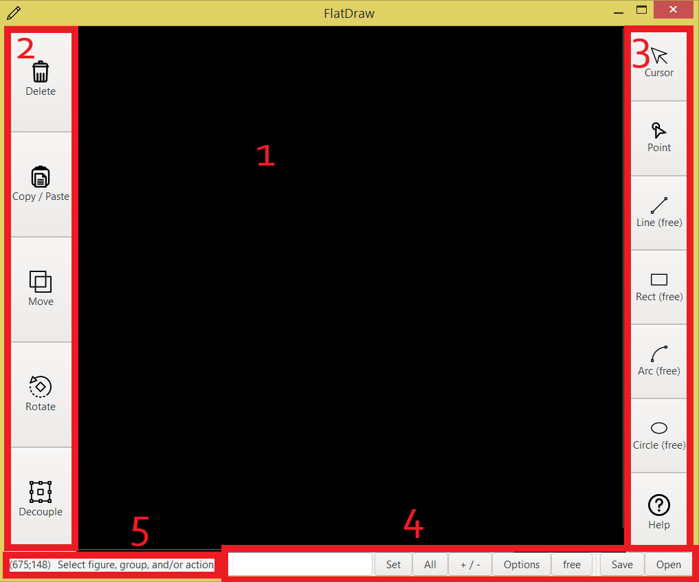

# FlatDraw user manual

## Content
+ [Interface](#interface)
+ [Drawing](#drawing)
    - [Points](#points)
	- [Lines](#lines)
	    - [Free](#lfree)
	    - [Parametric](#lprm)
	- [Rectangles](#rect)
	    - [Free](#rfree)
	    - [Parametric](#rprm)
	- [Circles](#circles)
	    - [Free](#cfree)
	- [Arcs](#arcs)
+ [Modification](#mod)
    - [Delete](#delete)
	- [Copy/Paste](#cp)
	- [Move](#move)
	- [Rotate](#rotate)
	- [Decouple](#dc)
+ [Common tool](#ct)
    - [Layer field](#lf)
	- [Save](#save)
	- [Open](#open)
	- [Drawing mode](#dm)
	- [Options](#opt)
	- [+ / -](#+-)
	- [All](#all)
	- [Set](#set)
+ [Information panel](#ip)

## Interface
In the screenshot below, the main interface elements are highlighted and signed in red.

1. The workspace where you are drawing
2. Modification panel. The tools in this panel allow you to move, copy, Ungroup, rotate, and delete figures
3. Drawbar. The tools in this panel allow you to draw points, lines, rectangles, and circles.
4. Common tool.
5. The information panel here you can see the tooltip and the cursor position.

## Drawing

### Points
To put a point, click on the "Point" button and then click in the appropriate places in the workspace. Points will appear after each click.

### Lines
FD supports 2 ways to create lines: free and parametric.

#### Free mode
First, make sure that the "Line" button is set to free mode. Otherwise, switch it. Click on the "Line" button
Then you can start drawing. Click to start the line, and click again to finish it, after moving the cursor to the desired location. When creating a drawing, you don't need to hold down the left mouse button.

#### Parametric mode
First, make sure that the "Line" button is set to parametric mode. Otherwise, switch it. Click on the "Line" button
You will see a dialog box where you can set the angle and length of the line, as well as the position relative to the cursor, in the corresponding fields.

### Rectangles
FD supports 2 ways to create rectangles: free and parametric.

#### Free mode
First, make sure that the "Rect" button is set to free mode. Otherwise, switch it. Click on the "Rect" button
Then you can start drawing. Click to start the rect, and click again to finish it, after moving the cursor to the desired location. When creating a drawing, you don't need to hold down the left mouse button.

#### Parametric mode
First, make sure that the "Rect" button is set to parametric mode. Otherwise, switch it. Click on the "Rect" button
You will see a dialog box where you can set the angle and length of the rect, as well as the position relative to the cursor, in the corresponding fields.

### Circles
At the moment, we only support 1 way to draw circles: free. Click on the "Circle" button.

#### Free mode
Click to start the circle, and click again to finish it, after moving the cursor to the desired location. When creating a drawing, you don't need to hold down the left mouse button.

### Arcs
Don't use this feature!

## Modification
To use the modification tools, switch to cursor mode (the "Cursor" button on the drawing panel). Then select the shape or group of shapes to apply the modification to.

### Delete
To delete the selected shapes, click the button.

### Copy/Paste
To copy the selected shapes, click the button. Then, select the base point relative to which you want to move. Then click on the point where the copied image should be inserted.

### Move
This tool works similarly to Copy/Paste. But unlike it, "Move" deletes the original.

### Rotate
By clicking on the button, a dialog will open in which you can select the rotation angle using the corresponding field. once the angle is specified, click "Apply".
After that, you must specify the point relative to which the shape should rotate.

### Decouple
This tool is only available for rectangles. It turns the rectangle into four adjacent lines.
Click the button and the rectangle will be ungrouped.

## Common tool

### Layer field
The only field located on the General toolbar indicates the current working level, or the level that will be made current.

### Save 
To save the current drawing, click on the "Save" button. after that, a dialog will open, enter the path where the file should be located, then click "OK".

### Open
To open a drawing, click on the "Open" button and a dialog will open. In the text field, enter the path to the file and click "OK".

### Drawing mode
This button changes the drawing mode. The label on it indicates the current mode. "Free" is free mode, "Prmt" is parametric mode.

### Options
Don't use this feature!

### + / -
This button is used to add or remove the current layer from the projection list. Projection layers are the layers that will be displayed along with the current working layer.

### All
This button displays all drawing layers in the workspace.

### Set
This button selects the level set in the field as current.

## Information panel
In this panel, you can see the cursor position in parentheses on the left, and short hints on the right.

---
FlatDraw v0.15 14.12.2020 by Centrix14
